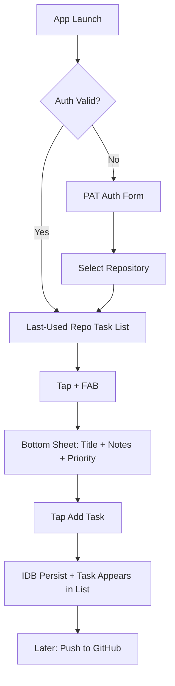
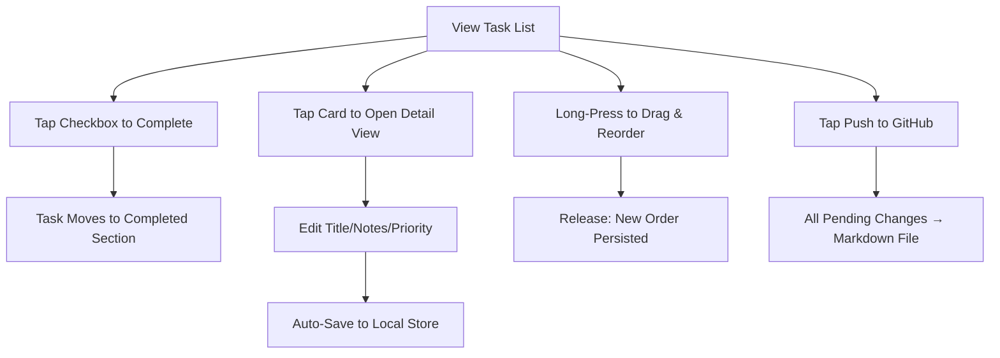
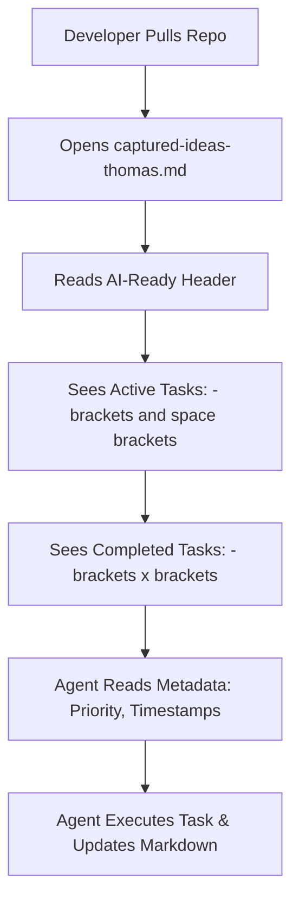
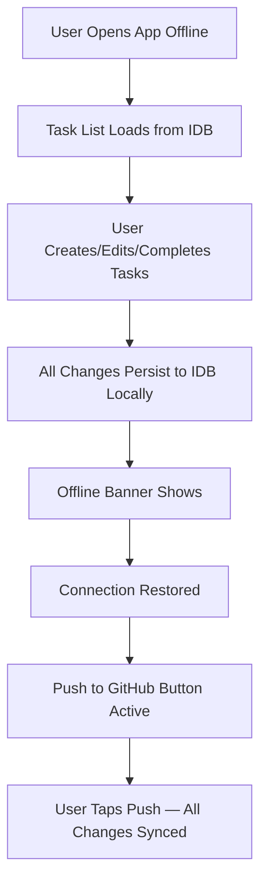

# UX Design Specification code-tasks

**Author:** Thomas
**Date:** 2026-03-10

---

<!-- UX design content will be appended sequentially through collaborative workflow steps -->

## Executive Summary

### Project Vision

**code-tasks** is a high-velocity developer vault designed to bridge the gap between inspiration and execution. It transforms a simple GitHub-hosted Markdown file into a premium, native-feeling task management experience. The goal is to provide a "pocket-to-captured" loop of less than 5 seconds, ensuring no technical spark is lost.

### Target Users

- **The High-Velocity Developer:** Needs immediate, one-handed capture while on the move.
- **The AI-Native Builder:** Relies on structured data for agent orchestration (Claude Code/Gemini).
- **The Midnight Creative:** Values a refined, low-strain aesthetic (Warm Dark Mode) for late-night sessions.

### Key Design Challenges

- **Aesthetic Synthesis:** Blending the utilitarian "GitHub" aesthetic (Primer-inspired) with the fluid, intentional motion of "Things 3" — the gold standard for todo app feel.
- **Connectivity Trust:** Providing absolute confidence in offline persistence through subtle but clear sync status indicators on every task card.
- **Markdown Transparency:** The app is a frontend for a markdown file, but users should never feel the limitation. Full task management (CRUD, reorder, complete, detail edit) must feel native despite persisting to a flat file.

### Design Opportunities

- **Signature Interactions:** Spring-physics bottom sheets, animated checkboxes, drag & drop reordering — every micro-interaction reinforces the "premium tool" feeling.
- **Developer-Centric Details:** GitHub-style status dots, "Pending"/"Synced" badges, monospaced metadata create instant familiarity for developers.
- **The "Push" Moment:** Explicit "Push to GitHub" as a deliberate, satisfying sync action — not a hidden background process.

## Core User Experience

### Defining Experience

The core experience of **code-tasks** is centered on the **"Real Todo App for Markdown."** It is designed to feel like a premium native task manager (think Things 3) — but every task, every checkbox, every priority flag is backed by a single `captured-ideas-{username}.md` file in a GitHub repo. The genius is that users never feel this limitation. They get full CRUD, drag & drop reordering, completion tracking, and a beautiful detail view — all persisted to a flat markdown file that AI agents can instantly consume.

### Platform Strategy

- **PWA (Progressive Web App):** Optimized for high-fidelity mobile interactions (iOS/Android via browser) and a focused desktop "utility" window.
- **Offline-First Resilience:** Uses IndexedDB for instant local writes, ensuring the app is functional and responsive even in "Airplane Mode" or subway tunnels.
- **Touch-First, Keyboard-Ready:** Primary interactions via touch (FAB tap, bottom sheet, checkbox tap, drag & drop). Power users get `Cmd+Enter` for keyboard capture.

### Effortless Interactions

- **Instant Landing:** The app opens directly to the last-used repository's task list. No passphrase, no selection screen. Authenticated → task list in < 1.5s.
- **One-Tap Capture:** FAB (+) → Bottom Sheet → type title → "Add Task". Three taps from idle to captured.
- **Explicit Sync:** Local changes are persisted instantly to IDB. GitHub sync happens when the user deliberately taps "Push to GitHub" — they control when their markdown file updates.

### Critical Success Moments

- **The "Midnight Spark":** A user captures an idea in < 3 seconds from cold start and feels the immediate relief of "it's handled."
- **The "Offline Win":** A user captures an idea while offline and sees it automatically appear on GitHub the moment they reconnect.
- **The "Agent Hand-off":** Seeing the "AI-Ready" header automatically applied, signaling that the task is ready for an agent to execute.

### Experience Principles

- **Speed Over Specification:** Prioritize rapid capture over detailed metadata. Capture now, refine later (or let the AI refine).
- **GitHub-Fluent:** Leverage familiar GitHub patterns (Markdown, Primer UI cues, monospaced fonts) to create immediate trust with developers.
- **Intentional Motion:** Every animation (slides, fades, card lifts) must reinforce the mental model of "placing an idea into a vault."
- **Utilitarian Elegance:** The UI should be clean and "quiet," using a GitHub-inspired palette to minimize visual noise during high-focus capture.

## Desired Emotional Response

### Primary Emotional Goals

The primary goal is to provide the **"Relief of the Vault."** Users should feel a distinct transition from the anxiety of "forgetting a good idea" to the calm of "it's securely stored in the repo." The experience should feel like placing a high-value item into a safe: tactile, certain, and professional.

### Emotional Journey Mapping

- **Launch:** Focused and Ready. "I have something to say, and the app is waiting for me."
- **Input:** Effortless Flow. "The interface isn't in my way; it's just me and my idea."
- **Capture:** Visceral Closure. "The idea is gone from my head and safe in the vault."
- **Post-Capture:** Lingering Satisfaction. "I can go back to sleep/work now; the next step is handled."

### Micro-Emotions

- **Trust (The Anchor):** Knowing that IndexedDB and GitHub are working in tandem to ensure zero data loss.
- **Precision (The Scalpel):** The feeling of a high-performance tool that does exactly one thing perfectly.
- **Calm (The Midnight Warmth):** A dark-mode palette that feels gentle on the eyes and "quiet" for the mind.

### Design Implications

- **Trust → Sync Indicators:** Subtle but definitive status icons (GitHub logo with a checkmark) that confirm "remote parity."
- **Relief → Launch Animation:** A satisfying "upward flick" or "shrink-into-vault" animation when a task is saved.
- **Precision → Monospaced Typography:** Using SF Mono or JetBrains Mono for metadata to reinforce the "Developer Tool" identity.

### Emotional Design Principles

- **Confirmation, Not Interruption:** Use non-blocking visual feedback for success (animations, haptics) rather than pop-ups.
- **Quiet Utilitarianism:** Avoid unnecessary "delight" that feels decorative. True delight comes from speed and reliability.
- **Developer Warmth:** A dark mode that isn't just "black," but a deep, GitHub-inspired navy or charcoal that feels professional and refined.

## UX Pattern Analysis & Inspiration

### Inspiring Products Analysis

- **GitHub (Utility & Trust):** The "North Star" for the visual language. We will use Primer-inspired UI cues (borders, grays, specific blue accents) to create immediate trust with developers. The monospaced typography for timestamps and IDs reinforces the "Source of Truth" feeling.
- **Things 3 (Motion & Polish):** The "North Star" for interaction design. We will adopt the "springy" physics for list reordering and the "slide-in" detail panel that doesn't break the user's mental map of the app.
- **Sorted 3 (Efficiency):** Inspiration for the "Binary Priority" (Important/Standard) pills, allowing for rapid categorization without complex tagging overhead.

### Transferable UX Patterns

- **Monospaced Metadata:** Using JetBrains Mono or SF Mono for the "Created" and "Status" fields to make the data feel like "Code."
- **Slide-over Detail Panels:** Tapping a task slides in a panel from the right/bottom, keeping the main list visible in the background "fog."
- **Floating Action "Push" Button:** A subtle, context-aware FAB that only appears when the local vault is ahead of GitHub, similar to a "New Message" indicator.
- **Binary Priority Pills:** Small, clickable status indicators that toggle between "Standard" (ghost button) and "Important" (filled accent).

### Anti-Patterns to Avoid

- **Over-Decoration:** Avoid shadows or gradients that feel "consumer-soft." Keep it "developer-sharp."
- **Modal Fatigue:** No center-screen pop-ups for editing. Everything happens in-line or in a side-panel.
- **Hidden Status:** Never hide the "Sync Status." A developer should never wonder if their idea is saved.

### Design Inspiration Strategy

- **Adopt:** GitHub's Dark Dimmed palette and status patterns (green=synced, amber=pending). Things 3's bottom sheet and checkbox interaction quality.
- **Adapt:** Things' spring physics tuned sharper (stiffness: 400) for a more utilitarian, developer-tool feel.
- **Avoid:** Complex onboarding. One-time PAT entry, then straight to task list forever. No passphrase gates, no tutorials.

## Design System Foundation

### 1.1 Design System Choice

**GitHub Primer (Adapted for High-Fidelity Motion)**

We will use GitHub's **Primer Design System** as the visual and structural foundation. This provides the "GitHub feeling" through its specific color palette, typography (SF Mono/Inter), and component anatomy (buttons, inputs, pills).

### Rationale for Selection

- **Immediate Trust:** Developers are already fluent in the Primer language. Using familiar cues like "Primary Blue" buttons and "Success Green" sync indicators creates instant confidence.
- **Information Density:** Primer is designed for high-density data environments, which aligns with our goal of showing repository context and task lists without clutter.
- **Theme Compatibility:** Primer's "Dark Mode" is world-class and perfectly suits our "Midnight Hacker" user archetype.

### Implementation Approach

- **Core Foundation:** CSS custom properties (`--color-canvas`, `--color-surface`, `--color-accent`, etc.) in `index.css` provide the GitHub Dark Dimmed palette. Utility classes (`.btn-primary`, `.text-body`, `.input-field`) for consistent styling. TailwindCSS 4 for layout.
- **Motion Layer:** **Framer Motion (v12+)** for all animations. Spring physics: `{ stiffness: 400, damping: 35 }` for bottom sheets, `{ stiffness: 400, damping: 30 }` for micro-interactions. `useReducedMotion()` fallback.
- **Haptic Integration:** `haptic-service.ts` maps task interactions to haptic patterns: `triggerSelectionHaptic()` on checkbox toggle, priority change, drag start.

### Customization Strategy

- **Bottom Sheet System:** The shared interaction pattern for task creation, task detail editing, and repo selection. Spring-animated slide-up, swipe-down-to-dismiss, click-outside-dismiss. Consistent handle bar and rounded top corners.
- **Typography System:** Custom CSS utility classes: `.text-hero` (32px), `.text-title` (20px), `.text-body` (14px), `.text-label` (12px), `.text-caption` (11px). System font stack for all text.
- **Custom Spacing:** Generous whitespace (12px card gaps, 16px padding) inspired by Things 3 to feel premium. Max content width `640px` for focused, mobile-first layout.

## 2. Core User Experience (Updated)

### 2.1 Defining Experience

The defining experience of **code-tasks** is the **"Native Todo, Markdown Soul."** Users interact with a real, full-featured task manager — create via FAB, check off with animated checkboxes, edit in a Things-style detail view, drag to reorder, push to GitHub when ready. The innovative twist: every interaction maps to changes in a single `captured-ideas-{username}.md` file that AI agents can immediately consume and act on.

### 2.2 User Mental Model

Users approach **code-tasks** as their **"Developer Task Inbox."** Each GitHub repository is a project. The task list is a living queue of ideas and TODOs. The user captures quickly, triages by priority and completion, and pushes to GitHub when ready for AI agents or collaborators to see. They expect the speed of Apple Reminders with the durability and transparency of a Git-tracked markdown file.

### 2.3 Success Criteria

- **Capture Speed:** FAB tap to task created in < 3 taps, < 5 seconds.
- **Zero-Touch Routing:** 90% of captures should occur without interacting with a repository selector (auto-selects last-used).
- **Visual Confirmation:** New task appears at the top of the list with a brief green border highlight, confirming local persist.
- **Completion Satisfaction:** Checkbox animation (spring fill + strikethrough) feels tactile and rewarding.

### 2.4 Novel UX Patterns

- **FAB + Bottom Sheet Creation:** The (+) button opens a spring-animated bottom sheet with Title (auto-focused), Notes, and Priority toggle. Swipe-down-to-dismiss for cancel. Fast, discoverable, familiar.
- **Things-Style Detail View:** Tapping a task opens a slide-up panel for rich editing — title, notes, priority, repo reassignment. Auto-save with 500ms debounce.
- **Active/Completed Split:** The task list is divided into active tasks (reorderable) and a collapsible "Completed (N)" section. Completed tasks show `- [x]` in the markdown.
- **Drag & Drop Reorder:** Long-press to pick up, drag to reposition. Only active tasks are reorderable. Order persists across sessions.

### 2.5 Experience Mechanics

1. **Initiation:** App opens instantly to last-used repo's task list. No passphrase. No loading gate.
2. **Capture:** User taps (+) FAB → Bottom Sheet slides up with spring animation → types title → taps "Add Task" → sheet closes → task appears at top of list with green highlight.
3. **Management:** Tap checkbox to complete (animated strikethrough, moves to Completed section). Tap card body to open detail view. Long-press to drag & reorder.
4. **Sync:** When ready, tap "Push to GitHub" → all pending changes written to `captured-ideas-{username}.md` → tasks marked as synced with green status dot.

## Visual Design Foundation

### Color System

The color palette is a direct evolution of the **GitHub Dark Dimmed** theme, optimized for the "Relief of the Vault" emotional goal.

- **Canvas:** `#0d1117` (Deep, focused background).
- **Surface:** `#161b22` (Slightly elevated cards and panels).
- **Primary Accent:** `#58a6ff` (GitHub Blue for the "Launch" button and active states).
- **Status (Sync):** `#3fb950` (Success Green) and `#d29922` (Pending Warning).
- **Typography:** `#c9d1d9` (Primary text) and `#8b949e` (Secondary metadata).

### Typography System

- **Interface Font:** **Inter** (System-first approach). Used for task titles and primary navigation.
- **Data Font:** **SF Mono** (Monospaced). Used for all Git-related metadata, including timestamps (`Created: 2026-03-10`), file paths, and status pills.
- **Hierarchy:** 
  - **H1 (Hero):** 24px, Semi-bold.
  - **Body (Tasks):** 16px, Regular.
  - **Meta (Technical):** 12px, Monospaced, Medium.

### Spacing & Layout Foundation

- **8px Base Grid:** All margins, paddings, and component heights are multiples of 8px.
- **Content Container:** `max-w-[640px]` centered container for the task list, search bar, and filter pills. Provides focused, mobile-first layout on all screen sizes.
- **Card Spacing:** 8px gap (`gap-2`) between task cards. 12px internal card padding. Adequate spacing for drag & drop lift animation.

### Accessibility Considerations

- **Contrast:** All text-on-background combinations meet **WCAG AA** standards (> 4.5:1).
- **Touch Targets:** Interactive elements (Important toggle, FAB, Card tap) maintain a minimum **44x44px** hit area for mobile usability.
- **Motion Reduction:** All spring animations respect the `prefers-reduced-motion` system setting, falling back to simple fades.

## Design Direction Decision

### Design Directions Explored

Six distinct visual directions were explored in the interactive showcase (`ux-design-directions.html`):
- **1. The Pulse Primary:** Focused capture input.
- **2. The Repo Hub:** Context-heavy header.
- **3. The Interactive Card:** Motion-focused list management.
- **4. The Developer CLI:** Terminal-inspired density.
- **5. The "Relief" Dark Mode:** Low-strain, warm aesthetics.
- **6. The Panel Detailer:** Refinement-focused side panels.

### Chosen Direction

**Evolved: The "Primer-Things" Direction**
Originally the "Primer-Pulse" hybrid, this direction has evolved through the Epic 7 course correction. It now combines the **tactile satisfaction of Things 3** (bottom sheets, animated checkboxes, spring physics, drag & drop) with the **high-trust GitHub Dark Dimmed** palette (5) and **Interactive Card (3)** motion design.

### Design Rationale

- **Velocity:** FAB (+) → Bottom Sheet → instant capture ensures the < 5s goal. One-tap creation is more discoverable than the original swipe gesture.
- **Trust:** GitHub visual language (status dots, sync badges, dark palette) creates an immediate "safe vault" feeling.
- **Polish:** Things-inspired spring animations, satisfying checkbox fills, slide-up detail panels, and drag & drop reordering differentiate the product from standard form-based apps.

### Implementation Approach

- **Visual Foundation:** Custom CSS design system on GitHub Dark Dimmed tokens. TailwindCSS 4 for layout.
- **Interactions:** Framer Motion for spring-based bottom sheets, layout transitions, checkbox animations, and drag & drop.
- **Feedback:** Haptic triggers on capture, complete, and drag start. Non-intrusive status badges on every task card.

## User Journey Flows

### 1. The Quick Capture

The "North Star" journey. FAB tap to captured task in under 5 seconds.

### 2. The Task Management Loop

The daily workflow: capture, triage, complete, sync.

### 3. The AI Agent Consumer

The moment where the developer sits down at their desk and sees their midnight work ready for execution.

### 4. The Offline Ideation

Ensuring that a lack of connectivity never results in a loss of ideas.

### Journey Patterns

- **Instant Landing:** Authenticated users land on their task list with zero intermediate screens.
- **Local-First Always:** Every action (create, edit, complete, reorder, delete) persists to IDB immediately. The UI never waits for a network request.
- **Explicit Sync:** GitHub sync is a deliberate user action ("Push to GitHub"), not a hidden background process. The user controls when their markdown file updates.
- **Visual Status Clarity:** Every task card shows its sync state via colored dot + badge (Pending/Synced).

### Flow Optimization Principles

- **One-Tap Create:** FAB is always visible. One tap opens the creation sheet.
- **Pre-emptive Routing:** Use `last_used_repo` to skip the selection screen on every subsequent launch.
- **Non-Blocking Feedback:** UI remains interactive during sync. Task appears instantly in list; sync status updates asynchronously.

## Component Strategy

### Design System Components

The app uses a custom design system built on **GitHub Dark Dimmed** color tokens, defined as CSS custom properties in `src/index.css`. Utility classes provide consistent styling across all components.

- **Foundations:** CSS custom properties for color (`--color-canvas`, `--color-surface`, `--color-accent`, `--color-success`, `--color-warning`, `--color-danger`, `--color-border`, `--color-text-primary`, `--color-text-secondary`), typography classes (`.text-hero`, `.text-title`, `.text-body`, `.text-label`, `.text-caption`), and interaction classes (`.btn-primary`, `.btn-ghost`, `.input-field`, `.badge`).
- **Animation:** Framer Motion constants in `src/config/motion.ts` — `TRANSITION_SPRING`, `TRANSITION_FAST`, `TRANSITION_NORMAL`, shared `pageVariants`, `listContainerVariants`, `listItemVariants`.

### Core Components

#### 1. CreateTaskFAB (+)
**Purpose:** Primary entry point for task creation. Always visible on the main screen.
**Location:** Fixed bottom-right, above SyncFAB.
**Behavior:** Tap opens CreateTaskSheet. 44x44px minimum touch target. Accent blue background.

#### 2. CreateTaskSheet (Bottom Sheet)
**Purpose:** Structured task creation form — Title (required, auto-focused), Notes (optional), Priority toggle.
**Animation:** Spring slide-up `{ stiffness: 400, damping: 35 }`. Swipe-down-to-dismiss. Click-outside-dismiss.
**Submit:** "Add Task" button or `Cmd+Enter`. Creates task in current repo, closes sheet, highlights new task in list.

#### 3. TaskCard
**Purpose:** Compact list item representing a single task. Shows animated checkbox, sync status dot, title (truncated), priority badge, and 1-line body preview.
**States:** Active (default), Completed (strikethrough + muted), Newest (green border highlight for 1.5s), Dragging (lifted with shadow).
**Interactions:** Tap checkbox → toggle complete. Tap card body → open TaskDetailSheet. Long-press → drag to reorder.

#### 4. TaskDetailSheet (Bottom Sheet)
**Purpose:** Rich editing panel for an existing task. Editable title, notes/description, priority toggle, created timestamp, repo assignment with "Move to..." action.
**Auto-Save:** 500ms debounce after last keystroke. Flush pending save on sheet close. Resets `syncStatus: 'pending'`.
**Animation:** Same spring system as CreateTaskSheet.

#### 5. SyncFAB ("Push to GitHub")
**Purpose:** Explicit sync trigger. Shows pending count badge when local changes exist.
**Location:** Fixed bottom-right, below CreateTaskFAB.
**States:** Idle (no pending), Active (pending count badge), Syncing (spinner), Success (checkmark flash), Error (red state).

#### 6. Active/Completed Task List Split
**Purpose:** Task list divided into active tasks (top, reorderable) and collapsible "Completed (N)" section (bottom).
**Behavior:** Completing a task → animated strikethrough → task moves to Completed section. Collapsible header with chevron rotation.

#### 7. RepoPickerSheet (Bottom Sheet)
**Purpose:** Repository selection and switching. Same bottom sheet pattern. Triggered from header or "Move to..." in detail view.

### Component Implementation Strategy

- **Motion Foundation:** All custom components use **Framer Motion** for layout animations, spring physics, and `AnimatePresence` for mount/unmount transitions.
- **Token Alignment:** All components use CSS custom properties (`--color-*`) to ensure visual consistency. No hardcoded color values in components.
- **Haptic Feedback:** `triggerSelectionHaptic()` on checkbox toggle, priority change, and drag start.
- **Bottom Sheet Consistency:** All sheets share the same animation pattern, handle bar, backdrop, and dismiss behavior. Defined once, reused everywhere.

### Implementation Roadmap (Epic 7 — Actual Sequence)

**Done — Foundation:**
- ~~PAT Auth with auto-recovery, no passphrase gate~~ (Story 7.1)
- ~~Per-repo task scoping in Zustand store~~ (Story 7.2)
- ~~CreateTaskFAB + CreateTaskSheet~~ (Story 7.3)
- ~~TaskCard with animated checkbox, completion toggle, Active/Completed split~~ (Story 7.4, in review)

**In Progress — Management:**
- TaskDetailSheet with inline editing, auto-save, repo reassignment (Story 7.5)
- Drag & drop reorder for active tasks (Story 7.6)
- Task deletion with confirmation (Story 7.7)

**Upcoming — Polish:**
- Branch protection detection and user guidance (Story 7.8)
- Sync UX polish — per-repo push, change detection, clear CTA (Story 7.9)

## UX Consistency Patterns

### Button Hierarchy

- **Primary Action (Launch):** Large, Primer-Blue button (`#58a6ff`). Used for the final capture step and the "Push" FAB.
- **Secondary Action (Manage):** Outline buttons with standard border (`#30363d`). Used for "Edit" or "Filter" actions.
- **Destructive Action (Archive/Delete):** Red text/border (`#f85149`). Used within the Detail Panel for archiving or permanent deletion.

### Feedback Patterns

- **Synchronized:** `octicon-check` in Success Green (`#3fb950`). Signals that local state matches GitHub.
- **Local-Only:** `octicon-sync` in Amber (`#d29922`). Signals that IndexedDB has the data, but the GitHub push is pending or in progress.
- **Disconnected:** `octicon-cloud-offline` in Muted Gray (`#8b949e`). Signals that the app is in offline mode.
- **Haptic Confirm:** A short, sharp vibration on "Capture" success; a longer, dull vibration on "Error/Failed Sync."

### Form Patterns

- **Bottom Sheet Creation:** CreateTaskSheet has Title (auto-focused, required), Notes (optional textarea), and PriorityPill toggle. Submit via "Add Task" button or `Cmd+Enter`. Title cannot be empty.
- **Inline Detail Editing:** TaskDetailSheet uses controlled inputs with 500ms debounce auto-save. No explicit "Save" button — changes persist on every pause. On sheet close, pending saves are flushed immediately.
- **Immediate Validation:** If no repository is selected, the app shows the repo selection screen. The task creation FAB only appears when a repo is active.

### Navigation Patterns

- **Repository Switcher:** Bottom sheet (RepoPickerSheet) triggered by tapping the repo name in the AppHeader. Same spring animation as all other sheets.
- **Task Detail:** Bottom-to-top slide-up panel (TaskDetailSheet). Dismissed by swipe-down, click-outside, or Escape key.
- **View Routing:** `App.tsx` manages three view states: `auth` → `repo-select` → `main`. Transitions use `AnimatePresence` with `mode="wait"`.

### Empty & Loading States

- **Initial Load:** `AuthSkeleton` component during Suspense hydration.
- **Empty Task List:** Centered icon + "No tasks yet" + "Tap (+) to capture your first idea" prompt.
- **Search/Filter Empty:** Inline message: "No tasks match '{query}'" or "No important tasks".

## Responsive Design & Accessibility

### Responsive Strategy

**code-tasks** is designed with a **Mobile-First, Desktop-Power** strategy. 

- **Mobile:** Focus on one-handed task management. FAB in thumb reach, bottom sheets for all creation/editing, 44x44px touch targets, haptic feedback, drag & drop reorder.
- **Desktop:** Keyboard-optimized: `Cmd+Enter` for quick capture. Bottom sheets work as centered modals on wider viewports. Max content width `640px` for focused experience.
- **Tablet:** Maintains the mobile layout but with more breathing room. Cards may show more metadata inline.

### Breakpoint Strategy

We will use standard logical breakpoints to ensure layout stability:

- **Mobile (Small):** 320px - 480px (Standard smartphone)
- **Mobile (Large):** 481px - 767px (Large phones/Phablets)
- **Tablet:** 768px - 1023px (Standard tablet portrait)
- **Desktop:** 1024px+ (Laptop/Desktop focused utility window)

### Accessibility Strategy

- **Compliance Level:** WCAG 2.1 Level AA.
- **Contrast:** High-contrast dark mode defaults using GitHub's color variables.
- **Interactive Targets:** Minimum 44x44px touch area for all mobile interactive elements.
- **Keyboard Navigation:** Logical tab order (FAB -> List -> Sync FAB) with visible focus rings. Escape key dismisses any open bottom sheet.
- **Screen Readers:** ARIA labels for all Octicons (e.g., `aria-label="Synchronized with GitHub"`) and Live Regions for status updates.

### Testing Strategy

- **Device Lab:** Verification on actual iOS (Safari) and Android (Chrome) devices to ensure PWA "Add to Home Screen" behavior is fluid.
- **Automated Audit:** Continuous accessibility testing using `axe-core`.
- **Keyboard-Only Pass:** Manual verification that the entire create-edit-complete-sync loop can be completed using only a keyboard.

### Implementation Guidelines

- **Relative Units:** Use `rem` for typography and `px` only for the 8px base grid borders.
- **Flexible Layouts:** Use CSS Flexbox and Grid (`Stack` components in Primer) to handle varying card heights based on description length.
- **Reduced Motion:** Ensure all Framer Motion animations respect `prefers-reduced-motion` settings.
