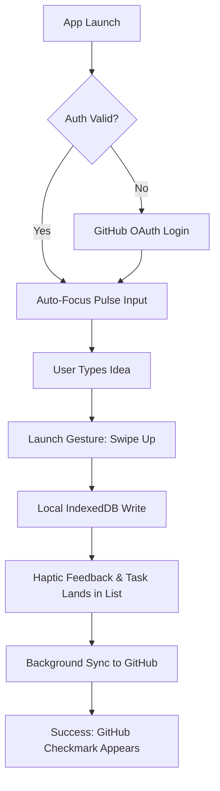
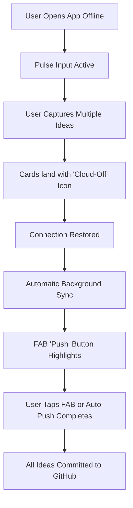
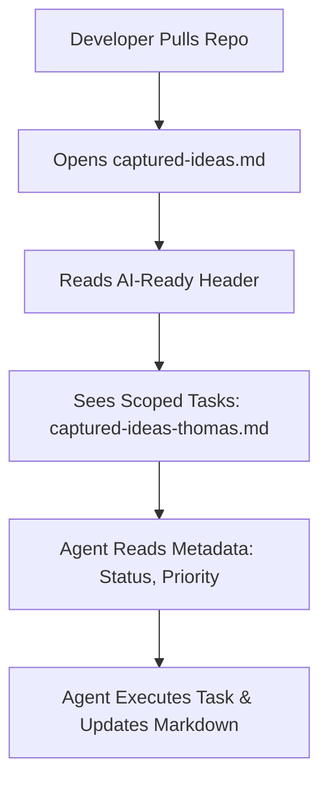

# UX Design Specification code-tasks

**Author:** Thomas
**Date:** 2026-03-10

---

<!-- UX design content will be appended sequentially through collaborative workflow steps -->

## Executive Summary

### Project Vision

**code-tasks** is a high-velocity developer vault designed to bridge the gap between inspiration and execution. It transforms a simple GitHub-hosted Markdown file into a premium, native-feeling task management experience. The goal is to provide a "pocket-to-captured" loop of less than 5 seconds, ensuring no technical spark is lost.

### Target Users

- **The High-Velocity Developer:** Needs immediate, one-handed capture while on the move.
- **The AI-Native Builder:** Relies on structured data for agent orchestration (Claude Code/Gemini).
- **The Midnight Creative:** Values a refined, low-strain aesthetic (Warm Dark Mode) for late-night sessions.

### Key Design Challenges

- **Aesthetic Synthesis:** Blending the utilitarian "GitHub" aesthetic (Primer-inspired) with the fluid, intentional motion of "Things."
- **Connectivity Trust:** Providing absolute confidence in offline persistence through subtle but clear state indicators.
- **Minimalist Density:** Maintaining a clean "Pulse" focus while surfacing repository context and sync status.

### Design Opportunities

- **Signature Capture Gesture:** Using spring physics and haptic-aligned animations to make "Saving" feel like a reward.
- **Developer-Centric Details:** Leveraging monospaced typography for metadata and GitHub-style "pills" for status to create instant familiarity.

## Core User Experience

### Defining Experience

The core experience of **code-tasks** is centered on the **"Zero-Friction Capture Loop."** It is designed to feel like a private, local scratchpad that has the ultimate durability of a GitHub repository. The interface disappears to let the user's thoughts flow directly into the "Pulse" input.

### Platform Strategy

- **PWA (Progressive Web App):** Optimized for high-fidelity mobile interactions (iOS/Android via browser) and a focused desktop "utility" window.
- **Offline-First Resilience:** Uses IndexedDB for instant local writes, ensuring the app is functional and responsive even in "Airplane Mode" or subway tunnels.
- **Input Parity:** Equal weight given to touch gestures (swipes for status/archive) and keyboard shortcuts (instant focus, hotkey-based capture).

### Effortless Interactions

- **The "Smart Route":** The app automatically opens to the last-used repository, eliminating the "Where do I put this?" cognitive load.
- **The "Pulse" Focus:** On launch, the cursor is automatically in the input field. No tapping required to start typing.
- **Silent Sync:** Local persistence happens on every keystroke; GitHub synchronization is handled as a background task with a non-intrusive status indicator.

### Critical Success Moments

- **The "Midnight Spark":** A user captures an idea in < 3 seconds from cold start and feels the immediate relief of "it's handled."
- **The "Offline Win":** A user captures an idea while offline and sees it automatically appear on GitHub the moment they reconnect.
- **The "Agent Hand-off":** Seeing the "AI-Ready" header automatically applied, signaling that the task is ready for an agent to execute.

### Experience Principles

- **Speed Over Specification:** Prioritize rapid capture over detailed metadata. Capture now, refine later (or let the AI refine).
- **GitHub-Fluent:** Leverage familiar GitHub patterns (Markdown, Primer UI cues, monospaced fonts) to create immediate trust with developers.
- **Intentional Motion:** Every animation (slides, fades, card lifts) must reinforce the mental model of "placing an idea into a vault."
- **Utilitarian Elegance:** The UI should be clean and "quiet," using a GitHub-inspired palette to minimize visual noise during high-focus capture.

## Desired Emotional Response

### Primary Emotional Goals

The primary goal is to provide the **"Relief of the Vault."** Users should feel a distinct transition from the anxiety of "forgetting a good idea" to the calm of "it's securely stored in the repo." The experience should feel like placing a high-value item into a safe: tactile, certain, and professional.

### Emotional Journey Mapping

- **Launch:** Focused and Ready. "I have something to say, and the app is waiting for me."
- **Input:** Effortless Flow. "The interface isn't in my way; it's just me and my idea."
- **Capture:** Visceral Closure. "The idea is gone from my head and safe in the vault."
- **Post-Capture:** Lingering Satisfaction. "I can go back to sleep/work now; the next step is handled."

### Micro-Emotions

- **Trust (The Anchor):** Knowing that IndexedDB and GitHub are working in tandem to ensure zero data loss.
- **Precision (The Scalpel):** The feeling of a high-performance tool that does exactly one thing perfectly.
- **Calm (The Midnight Warmth):** A dark-mode palette that feels gentle on the eyes and "quiet" for the mind.

### Design Implications

- **Trust → Sync Indicators:** Subtle but definitive status icons (GitHub logo with a checkmark) that confirm "remote parity."
- **Relief → Launch Animation:** A satisfying "upward flick" or "shrink-into-vault" animation when a task is saved.
- **Precision → Monospaced Typography:** Using SF Mono or JetBrains Mono for metadata to reinforce the "Developer Tool" identity.

### Emotional Design Principles

- **Confirmation, Not Interruption:** Use non-blocking visual feedback for success (animations, haptics) rather than pop-ups.
- **Quiet Utilitarianism:** Avoid unnecessary "delight" that feels decorative. True delight comes from speed and reliability.
- **Developer Warmth:** A dark mode that isn't just "black," but a deep, GitHub-inspired navy or charcoal that feels professional and refined.

## UX Pattern Analysis & Inspiration

### Inspiring Products Analysis

- **GitHub (Utility & Trust):** The "North Star" for the visual language. We will use Primer-inspired UI cues (borders, grays, specific blue accents) to create immediate trust with developers. The monospaced typography for timestamps and IDs reinforces the "Source of Truth" feeling.
- **Things 3 (Motion & Polish):** The "North Star" for interaction design. We will adopt the "springy" physics for list reordering and the "slide-in" detail panel that doesn't break the user's mental map of the app.
- **Sorted 3 (Efficiency):** Inspiration for the "Binary Priority" (Important/Standard) pills, allowing for rapid categorization without complex tagging overhead.

### Transferable UX Patterns

- **Monospaced Metadata:** Using JetBrains Mono or SF Mono for the "Created" and "Status" fields to make the data feel like "Code."
- **Slide-over Detail Panels:** Tapping a task slides in a panel from the right/bottom, keeping the main list visible in the background "fog."
- **Floating Action "Push" Button:** A subtle, context-aware FAB that only appears when the local vault is ahead of GitHub, similar to a "New Message" indicator.
- **Binary Priority Pills:** Small, clickable status indicators that toggle between "Standard" (ghost button) and "Important" (filled accent).

### Anti-Patterns to Avoid

- **Over-Decoration:** Avoid shadows or gradients that feel "consumer-soft." Keep it "developer-sharp."
- **Modal Fatigue:** No center-screen pop-ups for editing. Everything happens in-line or in a side-panel.
- **Hidden Status:** Never hide the "Sync Status." A developer should never wonder if their idea is saved.

### Design Inspiration Strategy

- **Adopt:** GitHub's color palette (Dark Mode) and typography hierarchy for data density.
- **Adapt:** Things' animation engine but "sharpen" the curves to feel faster and more utilitarian.
- **Avoid:** Complex multi-step onboarding. Launch immediately into the "Pulse" if authenticated.

## Design System Foundation

### 1.1 Design System Choice

**GitHub Primer (Adapted for High-Fidelity Motion)**

We will use GitHub's **Primer Design System** as the visual and structural foundation. This provides the "GitHub feeling" through its specific color palette, typography (SF Mono/Inter), and component anatomy (buttons, inputs, pills).

### Rationale for Selection

- **Immediate Trust:** Developers are already fluent in the Primer language. Using familiar cues like "Primary Blue" buttons and "Success Green" sync indicators creates instant confidence.
- **Information Density:** Primer is designed for high-density data environments, which aligns with our goal of showing repository context and task lists without clutter.
- **Theme Compatibility:** Primer's "Dark Mode" is world-class and perfectly suits our "Midnight Hacker" user archetype.

### Implementation Approach

- **Core Components:** Use Primer React/CSS for standard elements (inputs, buttons, repository lists).
- **Motion Layer:** Integrate **Framer Motion or Spring.js** to override standard Primer transitions. We will add "Things-style" spring physics to card lifts, list shifts, and panel slides.
- **Haptic Integration:** For mobile PWA usage, we will map Primer actions (e.g., clicking a "Sync" pill) to subtle haptic feedback patterns.

### Customization Strategy

- **The "Pulse" Input:** A completely custom, high-fidelity text area that extends Primer's base input with auto-expanding logic and a signature "launch" animation.
- **Typography Mix:** Use **Inter** for UI labels and **SF Mono** for all technical metadata (timestamps, file paths, status fields) to reinforce the "Git-backed" identity.
- **Custom Spacing:** Adopting a slightly more generous whitespace model (inspired by Things) than standard GitHub, to ensure the app feels "premium" and less "industrial."

## 2. Core User Experience

### 2.1 Defining Experience

The defining experience of **code-tasks** is the **"Pulse Launch."** It is the singular, high-velocity moment where a raw idea is transformed into a durable GitHub record. Unlike traditional task managers that require multiple taps for project, tags, and priority, the Pulse Launch assumes speed is the only metric that matters at the moment of capture.

### 2.2 User Mental Model

Users approach **code-tasks** as a **"Remote Extension of their Brain."** They view the GitHub repository as a permanent, immutable vault and the app as the fastest possible "Input Terminal" for that vault. They expect the reliability of a local `.txt` file with the collaborative and AI-ready benefits of a hosted GitHub repository.

### 2.3 Success Criteria

- **Interaction Latency:** The UI must respond to the "Capture" trigger in < 100ms.
- **Zero-Touch Routing:** 90% of captures should occur without the user ever interacting with a repository selector.
- **Visual Confirmation:** A clear "Success" state (e.g., the GitHub "Check" icon) that confirms the local IndexedDB write was successful.

### 2.4 Novel UX Patterns

- **The "Pulse" Text Area:** A hybrid input that behaves like a simple text box but intelligently separates the first line (Title) from subsequent lines (Description) using subtle visual weight shifts.
- **"Launch" Gesture:** A vertical swipe-up on the Pulse area that "sends" the task into the list below, reinforcing the mental model of placing an object into a container.

### 2.5 Experience Mechanics

1. **Initiation:** App launch automatically focuses the Pulse input. The keyboard is already up.
2. **Interaction:** User types idea. Subtle "Important" toggle is accessible via a single tap next to the text.
3. **Feedback:** As the user swipes up, the text area collapses and a "ghost" of the task follows the finger, landing in the list with a springy bounce.
4. **Completion:** The Pulse input clears instantly, ready for the next spark. A small "Syncing" spinner appears on the task card, turning into a GitHub checkmark when the remote push is complete.

## Visual Design Foundation

### Color System

The color palette is a direct evolution of the **GitHub Dark Dimmed** theme, optimized for the "Relief of the Vault" emotional goal.

- **Canvas:** `#0d1117` (Deep, focused background).
- **Surface:** `#161b22` (Slightly elevated cards and panels).
- **Primary Accent:** `#58a6ff` (GitHub Blue for the "Launch" button and active states).
- **Status (Sync):** `#3fb950` (Success Green) and `#d29922` (Pending Warning).
- **Typography:** `#c9d1d9` (Primary text) and `#8b949e` (Secondary metadata).

### Typography System

- **Interface Font:** **Inter** (System-first approach). Used for task titles and primary navigation.
- **Data Font:** **SF Mono** (Monospaced). Used for all Git-related metadata, including timestamps (`Created: 2026-03-10`), file paths, and status pills.
- **Hierarchy:** 
  - **H1 (Pulse):** 24px, Semi-bold.
  - **Body (Tasks):** 16px, Regular.
  - **Meta (Technical):** 12px, Monospaced, Medium.

### Spacing & Layout Foundation

- **8px Base Grid:** All margins, paddings, and component heights are multiples of 8px.
- **The "Pulse" Sanctuary:** The top input area is reserved with 32px of vertical padding to ensure the cursor and text feel uncrowded.
- **Card Spacing:** 12px gap between list items to allow for the "Shadow Lift" animation during drag-and-drop without overlapping neighbors.

### Accessibility Considerations

- **Contrast:** All text-on-background combinations meet **WCAG AA** standards (> 4.5:1).
- **Touch Targets:** Interactive elements (Important toggle, FAB, Card tap) maintain a minimum **44x44px** hit area for mobile usability.
- **Motion Reduction:** All spring animations respect the `prefers-reduced-motion` system setting, falling back to simple fades.

## Design Direction Decision

### Design Directions Explored

Six distinct visual directions were explored in the interactive showcase (`ux-design-directions.html`):
- **1. The Pulse Primary:** Focused capture input.
- **2. The Repo Hub:** Context-heavy header.
- **3. The Interactive Card:** Motion-focused list management.
- **4. The Developer CLI:** Terminal-inspired density.
- **5. The "Relief" Dark Mode:** Low-strain, warm aesthetics.
- **6. The Panel Detailer:** Refinement-focused side panels.

### Chosen Direction

**Hybrid: The "Primer-Pulse" Direction**
This direction combines the extreme focus of the **Pulse Primary (1)** with the tactile satisfaction of the **Interactive Card (3)**, all rendered in the high-trust **GitHub Dark Dimmed** palette (5).

### Design Rationale

- **Velocity:** The Pulse Primary interaction ensures the < 5s capture goal is met.
- **Trust:** Using the GitHub visual language creates an immediate "Safe Vault" feeling.
- **Polish:** Things-inspired card animations differentiate the product from a standard "form-based" app, making it feel like a premium tool.

### Implementation Approach

- **Visual Foundation:** GitHub Primer CSS/React components.
- **Interactions:** Framer Motion for spring-based list transitions and "flick-to-save" gestures.
- **Feedback:** Haptic triggers for successful local saves and non-intrusive status pills for background sync.

## User Journey Flows

### 1. The High-Velocity Capture

This is the "North Star" journey. The goal is to minimize every millisecond between the user's thought and the vault's confirmation.

### 2. The Offline Ideation

Ensuring that a lack of connectivity never results in a loss of momentum.

### 3. The AI Agent Consumer

The moment where the developer sits down at their desk and sees their midnight work ready for execution.

### Journey Patterns

- **Auto-Focus First:** Every journey that involves input starts with an immediate focus on the text field.
- **Background-First Sync:** User never waits for a network request to complete their core action.
- **Visual Staging:** Using "Cloud-Off," "Syncing," and "GitHub Check" icons to communicate the three states of an idea's life.

### Flow Optimization Principles

- **Eliminate the Middleman:** No "Save" button; the gesture *is* the save.
- **Pre-emptive Routing:** Use the `last_used_repo` to skip the selection screen entirely during the capture loop.
- **Non-Blocking Feedback:** UI remains interactive while background tasks (sync, AI initialization) occur.

## Component Strategy

### Design System Components

We will utilize **GitHub Primer React** for all standard UI elements to maintain the "GitHub-fluent" identity.

- **Foundations:** Primer design tokens for color, spacing, and typography.
- **Navigation:** `ActionList` for the repository selector and `NavList` for any secondary settings.
- **Feedback:** Standard `Label` components for "Important" and "Status" pills, ensuring they match the GitHub UI exactly.

### Custom Components

#### 1. The Pulse Input
**Purpose:** The primary capture terminal for new ideas.
**Anatomy:** A large, borderless `TextArea` that auto-expands. Includes a "ghost" label and a subtle "Important" toggle.
**Interaction Behavior:** Supports a vertical swipe-up gesture to trigger the "Launch" sequence. Keyboard users use `Cmd+Enter`.

#### 2. The Interactive Task Card
**Purpose:** Represents a single task in the list with high tactile feedback.
**States:** Default, Dragging (Lifts with shadow), Swiping (Reveals green 'Done' or amber 'Archive' backgrounds), and Syncing (Pulsing ghost state).
**Interaction Behavior:** One-tap to open Detail Panel; swipe-left to archive; swipe-right to complete.

#### 3. The Ghost-Writer FAB
**Purpose:** To signal when local IndexedDB data is ahead of the GitHub remote.
**Visuals:** A standard Primer-style FAB (`#58a6ff`) with a subtle "breathe" animation. Only visible when `sync_needed = true`.

### Component Implementation Strategy

- **Motion Foundation:** All custom components will use **Framer Motion** for layout animations and spring physics.
- **Token Alignment:** Custom components will strictly use Primer CSS variables (`--color-accent-fg`, etc.) to ensure theme switching (Light/Dark/Dimmed) is automatic.
- **Haptic feedback:** Map "Capture," "Complete," and "Archive" to distinct haptic patterns (Light, Medium, Heavy taps).

### Implementation Roadmap

**Phase 1 - The Core Loop:**
- Pulse Input (Capture)
- Task Card (Basic Display)
- GitHub OAuth Integration

**Phase 2 - The Management Layer:**
- Swipe Actions (Done/Archive)
- Drag-and-Drop (Reordering)
- Ghost-Writer FAB (Syncing)

**Phase 3 - The Detail Layer:**
- Slide-in Detail Panel
- Markdown Description Editor
- Checklist Sub-tasks

## UX Consistency Patterns

### Button Hierarchy

- **Primary Action (Launch):** Large, Primer-Blue button (`#58a6ff`). Used for the final capture step and the "Push" FAB.
- **Secondary Action (Manage):** Outline buttons with standard border (`#30363d`). Used for "Edit" or "Filter" actions.
- **Destructive Action (Archive/Delete):** Red text/border (`#f85149`). Used within the Detail Panel for archiving or permanent deletion.

### Feedback Patterns

- **Synchronized:** `octicon-check` in Success Green (`#3fb950`). Signals that local state matches GitHub.
- **Local-Only:** `octicon-sync` in Amber (`#d29922`). Signals that IndexedDB has the data, but the GitHub push is pending or in progress.
- **Disconnected:** `octicon-cloud-offline` in Muted Gray (`#8b949e`). Signals that the app is in offline mode.
- **Haptic Confirm:** A short, sharp vibration on "Capture" success; a longer, dull vibration on "Error/Failed Sync."

### Form Patterns

- **The Pulse Textarea:** Single-field entry. Automates metadata creation (Title vs. Description) without requiring the user to switch fields.
- **Immediate Validation:** If a repository hasn't been selected, the Pulse input remains in a "Staged" state with a prompt to "Select Target Repo" before launch.

### Navigation Patterns

- **Repository Switcher:** A slide-over `ActionList` triggered by tapping the repository name in the header.
- **Task Detail:** A right-to-left slide-in panel (Desktop) or bottom-to-top (Mobile). Dismissed by swiping in the opposite direction.

### Empty & Loading States

- **Initial Load:** GitHub-style skeleton loaders for the task list.
- **Empty Vault:** A centered illustration of a GitHub octocat holding a notebook, with a prompt: "No technical sparks yet. Start typing above."

## Responsive Design & Accessibility

### Responsive Strategy

**code-tasks** is designed with a **Mobile-First, Desktop-Power** strategy. 

- **Mobile:** Focus on one-handed capture. Uses large touch targets and gesture-based saving (Swipe up).
- **Desktop:** Optimized for keyboard velocity. Uses `Cmd+Enter` for capture and surfaces repository branch/path information in a side margin when space permits.
- **Tablet:** Maintains the mobile layout but expands the task cards to show more metadata (tags, full timestamps) inline.

### Breakpoint Strategy

We will use standard logical breakpoints to ensure layout stability:

- **Mobile (Small):** 320px - 480px (Standard smartphone)
- **Mobile (Large):** 481px - 767px (Large phones/Phablets)
- **Tablet:** 768px - 1023px (Standard tablet portrait)
- **Desktop:** 1024px+ (Laptop/Desktop focused utility window)

### Accessibility Strategy

- **Compliance Level:** WCAG 2.1 Level AA.
- **Contrast:** High-contrast dark mode defaults using GitHub's color variables.
- **Interactive Targets:** Minimum 44x44px touch area for all mobile interactive elements.
- **Keyboard Navigation:** Logical tab order (Pulse -> List -> Sync FAB) with visible focus rings.
- **Screen Readers:** ARIA labels for all Octicons (e.g., `aria-label="Synchronized with GitHub"`) and Live Regions for status updates.

### Testing Strategy

- **Device Lab:** Verification on actual iOS (Safari) and Android (Chrome) devices to ensure PWA "Add to Home Screen" behavior is fluid.
- **Automated Audit:** Continuous accessibility testing using `axe-core`.
- **Keyboard-Only Pass:** Manual verification that the entire "Pulse-to-Vault" loop can be completed using only a keyboard.

### Implementation Guidelines

- **Relative Units:** Use `rem` for typography and `px` only for the 8px base grid borders.
- **Flexible Layouts:** Use CSS Flexbox and Grid (`Stack` components in Primer) to handle varying card heights based on description length.
- **Reduced Motion:** Ensure all Framer Motion animations respect `prefers-reduced-motion` settings.
